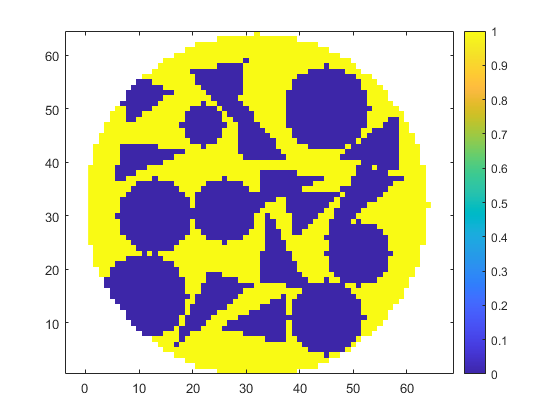
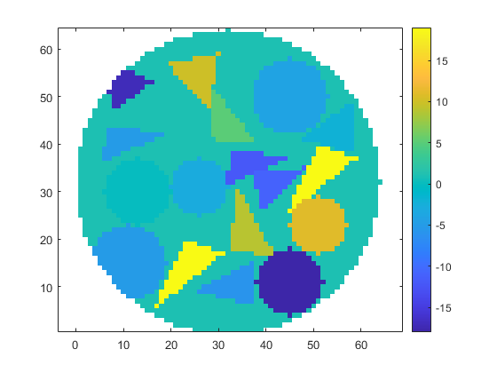

<!DOCTYPE html
  PUBLIC "-//W3C//DTD HTML 4.01 Transitional//EN">
<html><head>
      <meta http-equiv="Content-Type" content="text/html; charset=utf-8">
  </head><body>
<h2>Contents</h2>
<ul><li><a href="#1">Draw circular and triangular targets with random positions inside a circle without overlap</a></li><li><a href="#2">Create a logical image of a circle with specified diameter, center, and image size.</a></li><li><a href="#3">User-defined parameters</a></li><li><a href="#4">Generating the targets</a></li><li><a href="#6">Shape definition</a></li><li><a href="#7">Positioning targets inside the circle and attributing values</a></li><li><a href="#8">Results back to 64x64 images</a></li><li><a href="#10">Binary mask visualization</a></li><li><a href="#11">Resulting targets visualization</a></li></ul>
<h2 id="1">Draw circular and triangular targets with random positions inside a circle without overlap</h2><pre class="codeinput">clear
clc
close all
</pre><h2 id="2">Create a logical image of a circle with specified diameter, center, and image size.</h2>
Based on <a href="https://matlab.fandom.com/wiki/FAQ#How_do_I_create_a_circle.3F">https://matlab.fandom.com/wiki/FAQ#How_do_I_create_a_circle.3F</a>
<pre class="codeinput">%Image parameters
imageSizeX = 64; %works for square images
imageSizeY = 64;
[columnsInImage, rowsInImage] = meshgrid(1:imageSizeX, 1:imageSizeY);
dimension = 2;

% Circle parameters.
centerX = 32;
centerY = 32;
radius = 32;

%Calculating circle points
circlePixels = (rowsInImage - centerY).^2 + (columnsInImage - centerX).^2 &lt;= radius.^2;

%Converting from logical to double and displaying
vq = double(circlePixels);
vq((vq==0)) = NaN; % We don't want objects outside of the circle
</pre><h2 id="3">User-defined parameters</h2><pre class="codeinput">it = 1; %number of simulations
samples = zeros(it,imageSizeX,imageSizeY); %initialize tensor to store the results

% Next: Do not define both 'number' and 'mask_side' as large numbers
% The code won't find a solution

% Choose the number of targets inside the circle
number = randi([26 26],it,1); %For a fixed number, use [n n] as the first randi argument

% Choose the size of the mask where the shapes are defined
mask_side = randi([12 18],it,1);
mask_side = mask_side + mod(mask_side,2); % To force an even value

% Choose a pixel value to limit the region of the targets
limit = 8; %must be an even number

% Target values scale
max_val = 50;
min_val = -50;
delta_val = max_val - min_val;

%Target vales
max_target_val = 20;
min_target_val = -5;

%Time Counter
tic
</pre><h2 id="4">Generating the targets</h2><pre class="codeinput">for i = 1:it
</pre><h2 id="6">Shape definition</h2><pre class="codeinput">    A = zeros(mask_side(i),mask_side(i),number(i));

% Calculate 'i' triangular and circular masks
       [A1] = mask_triangles(A, number(i), dimension, mask_side(i));
       [A2] = mask_circles(A, number(i), dimension, mask_side(i));

% Selecting random shapes
    sorteio1 = randi([1 2], number(i), 1); %if you want just one shape, let randi([n n],...)
    sorteio2 = randi([1 number(i)], number(i), 1); %this is necessary to use different shapes

    j = 1:number(i)
       sorteio1(j,1) == 1
            A(:,:,j) = A1(:,:,sorteio2(j,1));
       sorteio1(j,1) == 2
            A(:,:,j) = A2(:,:,sorteio2(j,1));
    clear A1 A2
</pre><h2 id="7">Positioning targets inside the circle and attributing values</h2><pre class="codeinput">  position %see attached file
</pre><pre class="codeoutput">Success
Success
Success
Success
Success after some tries
     3

Success after some tries
     1

Success after some tries
     2

Success after some tries
    12

Success
Success after some tries
   115

Success after some tries
    14

Success after some tries
    26

Failed, target lost
Success after some tries
    71

Success after some tries
    56

Success after some tries
    84

Failed, target lost
Failed, target lost
Failed, target lost
Success after some tries
    43

Success after some tries
    16

Failed, target lost
Success after some tries
    88

Failed, target lost
Failed, target lost
Failed, target lost
</pre><h2 id="8">Results back to 64x64 images</h2><pre class="codeinput">% Binary mask
matrix_64 = ones(64,64);
matrix_64(limit/2:matrix_side+limit/2-1, limit/2:matrix_side+limit/2-1) = matrix;
% Resulting targets
matrix_64_val = ones(64,64);
matrix_64_val(limit/2:matrix_side+limit/2-1, limit/2:matrix_side+limit/2-1) = matrix2;
%Note: It is possible to concatenate the images of each iteration to a tensor
</pre><pre class="codeinput">end
toc
</pre><pre class="codeoutput">Elapsed time is 8.296840 seconds.
</pre><h2 id="10">Binary mask visualization</h2><pre class="codeinput">final = matrix_64.*vq;
figure;
h = imagesc(final);
set(h, 'AlphaData', ~isnan(final))
set(gca, 'YDir','normal')
colorbar
axis equal
</pre> <h2 id="11">Resulting targets visualization</h2><pre class="codeinput">final2 = matrix_64_val.*vq;
figure;
h = imagesc(final2);
set(h, 'AlphaData', ~isnan(final2))
set(gca, 'YDir','normal')
colorbar
axis equal
</pre> 
 <a href="https://www.mathworks.com/products/matlab/">Published with MATLAB&reg; R2023a</a> 

<!--

--></body></html>
